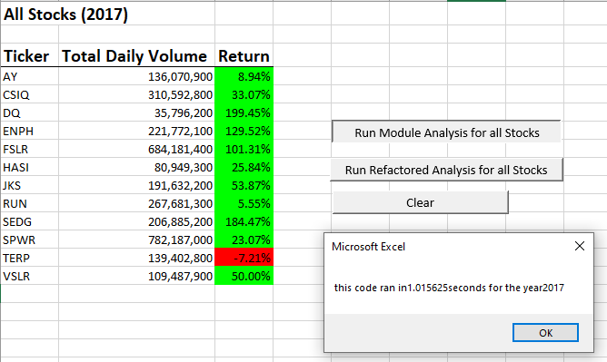
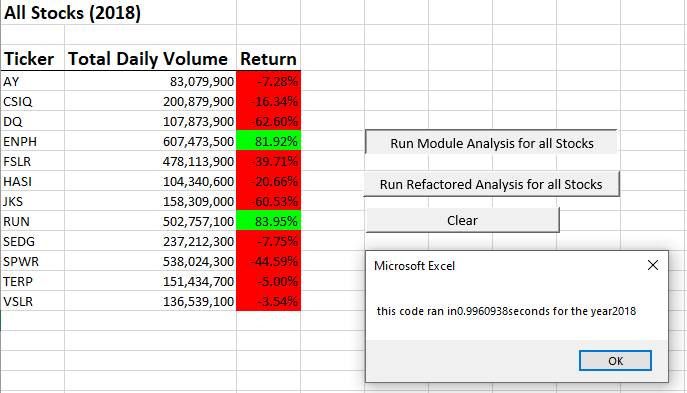
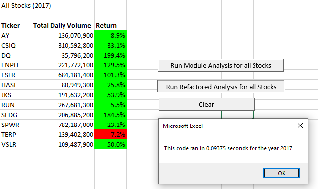
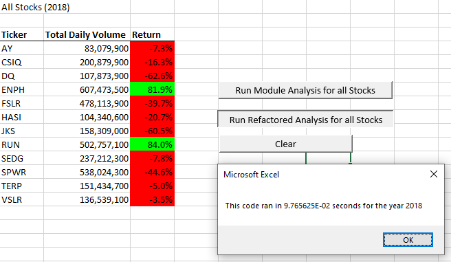

# An Analysis of Green Stocks

## Overview of Project

### Purpose

The purpose of this project is to provide Steve with an effective and efficient tool for the analysis of stocks. The results of two years of green stock performance will be analized to determine a recommendation for investment. Furthermore, refactored code will be compared to the orignally developed code to determine the best method for conducting the analysis Steve requires going forward.

## Results

### Stock performance

Comparing the results of the stock performance analysis shown below, it is recommended that Steve invest in the stock with ticker ENPH as this stock had strong performance in both years with an overall average return of 105.72%. If diversification is needed then the only other stock that demonstrated positive returns in both years is the one with the ticker RUN which had an overall average return of 44.75%.

### Code performance

The performance of the refactored code is clearly more efficent then the original script. This can be seen by comparing the run times of the respective analyses. The screenshots provided in the prior section on stock performance also display the runtime using the original script. The screenshots below provide the runtime for the same analysis performed with the refactored code. 

A comparison of the runtime results for both blocks of code is summarized in the chart below.

|Code| 2017 | 2018 |
|---|---|---|
|Original|1.015625 seconds|0.9960938 seconds|
|Refactored|0.1054688 seconds|0.1054688 seconds|

As can be seen the refactored code runs nearly 10 times faster then the original script and so is clearly the most efficent for Steve to use going forward.

## Summary
